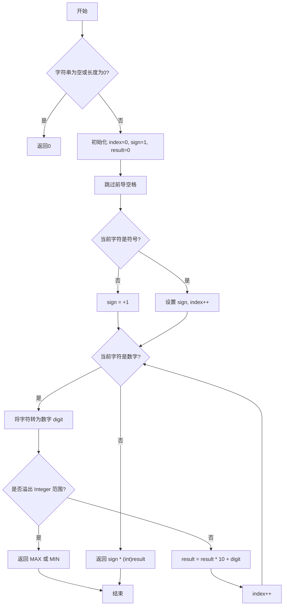

```mermaid
graph TD
    A[开始] --> B{字符串为空或长度为0?}
    B -- 是 --> C[返回0]
    B -- 否 --> D[初始化 index=0, sign=1, result=0]

    D --> E[跳过前导空格]
    E --> F{当前字符是符号?}
    F -- 是 --> G[设置 sign, index++]
    F -- 否 --> H[sign = +1]

    H --> I{当前字符是数字?}
    G --> I

    I -- 是 --> J[将字符转为数字 digit]
    J --> K{是否溢出 Integer 范围?}
    K -- 是 --> L[返回 MAX 或 MIN]
    K -- 否 --> M[result = result * 10 + digit]
    M --> N[index++]

    N --> I

    I -- 否 --> O["返回 sign * (int)result"]
L --> P[结束]
O --> P

```